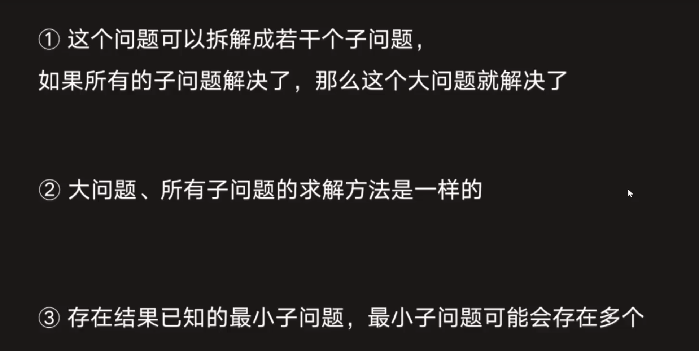

# 这里是记录java算法的学习笔记

### 11. 呈最多水的容器
利用双指针，逐个缩减指针距离，其时间复杂度为O(n);

### 12. 数字转罗马数
可以使用哈希表，将数据存放其中，遍历得到结果。

### 13. 罗马转数字
对于需要看两位char以上的字符串，可以先进行replace操作，把可能有影响的字符换掉。

### 19. 删除倒数第n个结点
可以定义一个dummy结点指向head，即dummy.next=head。后续因为是倒数第n个，可以先定义一个right在dummy往右走n，再定义一个left在dummy，这样他们之间就永远相差n，再让right往右走到底即可

### 20. 有效的括号
出现有对应关系的情况，可以使用哈希表来进行存储，在需要判断的地方拿出判断。

### 26. 去重数组
1.采用双指针方法，一个用于遍历，一个用于记录最后一个有效位
2.（每个数字保留k个通用解）对其进行实时记录判断。

### 41. 缺失的第一个正数
要求O(n)时间复杂度且O(1)的空间复杂度，可以考虑直接在本数组上进行操作，将原数组调整为哈希表的形式。

---

### 递归学习
使用递归的场景： 问题可以拆分，已知最小子问题（最小子问题，操作，子问题）

1.一次递归：一般用于线性数据结构 两次递归：看成对二叉树的遍历 多次递归：多叉数。
2.尾递归：递归的最后一步是返回下一个子问题。优点：空间会优化 