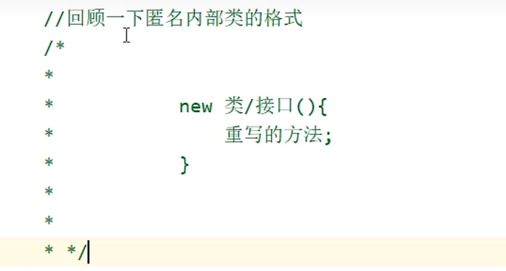

# 这里是记录java的学习笔记

---

### 1.有关进制问题

---

### 2.对long数据类型进行定义的时候，需要在数字末尾加一个*L*
### float类型需要在后面加*F*
~~~
    long b = 999999999999L;
    float f = 20.2F
~~~

---

### 3.命名规范

---

### 4.JAVA项目的Structure:
### project(项目)->module(模块)->package(包)->class(类)

（src不是）

---

### 5.运算的隐式转换规则
 - byte->short->int->long->float->double  
取值范围是反过来的
 - byte short char这三种在运算时（不管有没有其他的类型）会先转换成int，再进行运算

---

### 6.逻辑运算符

---

### 7.短路运算符（相比普通的会更加常用）

---

### 8.数组的地址值含义
例如：[I@723279cf  
其中[表示是数组，I表示int类型，后面是16进制的地址,其实这个地址就是该数据存放在堆中的地址，被赋值给了在栈中定义的变量

---

### 9.Java中的内存相关
 - 堆内存中存放的是所有用new字段创建的对象信息
 - 方法相关是存放到栈中(先进后出)

---

### 10.重载存在于同一个类中的两个方法，要求方法名相同，以及形参有区别（类型或者个数的区别，与返回值类型无关）

---

### 11.有main方法的类叫做测试类，描述一类事务的类叫做Javabean类（里面有成员变量和成员方法），
同时对于每个私有化的成员变量，都要提供set和get方法。例如：
 ~~~java
public void setName(String n){
    name = n;
}
public String getName(){
    return name
}
~~~

---

### 12. this指的是成员变量或者成员方法信息（即类的相关内容和）

---

### 13. 构造方法（创造对象的时候，虚拟机会自动调用构造方法，目的是给成员变量进行初始化）：

在构造之时，要写上带参的和不带参数的构造方法

--- 

### 14. 成员变量和局部变量的区别

---

### 15. String的几种定义方式在内存中的情况
 - 直接赋值情况下会在StringTable中把该值存进去，有相同的字符串，则把地址赋值过去。

 - 通过new出来的赋值方式，在堆中创建新的空间，：

---

### 16. String一般通过s1.equals(s2)进行判断
str.toCharArray()方法可以直接将字符串转换为字符数组;

---

### 17. 使用String Builder的场景：
 - 字符串的拼接
 - 字符串的反转

---

### 18. StringJoiner:
在创建时即可指定字符串的开始符号、结束符号和间隔符号

---

### 19. ArrayList集合：
集合的范围不是固定的，可以随增删变化

---

### 20. 静态变量是随着类的加载而加载的，优先于对象出现的
当属性需要被当前类的所有对象共享时，需要加static

静态方法只能访问静态
非静态方法可以访问所有
静态方法中没有this关键字
（this表示的是当前方法调用者的地址值）

---

### 21.继承

Java只支持单继承，不能多继承，可以多层继承。
所有的类都直接或间接继承于Object。
子类只能访问父类的非私有化成员

---

### 22.util class

---

### 23. private 默认 protected public

---

### 24. 静态代码块
在程序刚开始的时候就可以执行的内容（其放在main入口之外），只执行一次

---

### 25. abstract
abstract类表示不想让外界产生本类的对象

---

### 26.XXXAdaptor

---

---

### 27.BigInteger BigDecimal

前者是创建了许多的32位数组存放超长数字
后者是对每一位的ASCII码进行存储到数组中

---
### 28. 内部类调用与外部类相同的变量等

---
### 29. 匿名内部类
使用场景：有一个对象只需要调用一次另一个类/接口中的方法，就可以不必再写一个类，直接通过匿名函数类的方式，对其进行override重写操作

